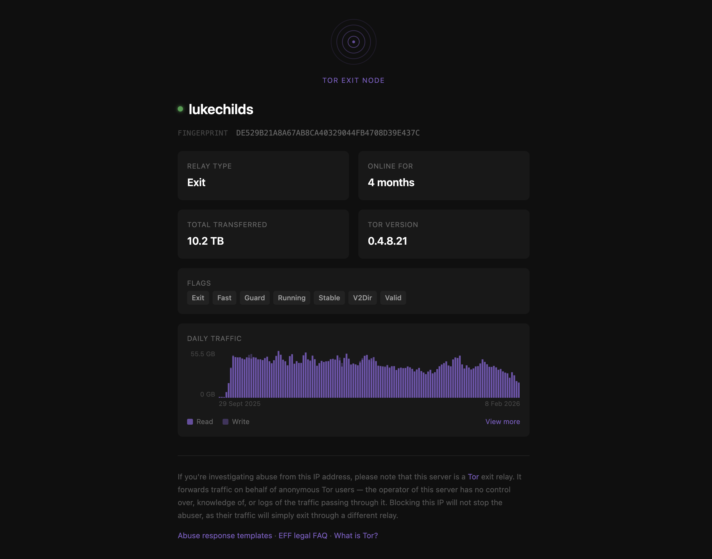

# tor-exit

> Single command Tor exit node setup

This is my Tor exit node configuration that I run at [tor-exit.lu.ke](https://tor-exit.lu.ke/). Provided here as a docker compose configuration you can run in one command.

If you're thinking of running a Tor exit node, make sure you understand the risks and [read this](https://blog.torproject.org/tips-running-exit-node/) first.

## Overview

- Tor built from source with a pinned version for reproducibility
- [nyx](https://nyx.torproject.org/) included for monitoring
- Live tmux dashboard for server monitoring
- Live web dashboard for public data and Tor abuse links



## Usage

```sh
docker compose up -d
```

That's it. You may want to backup the `data/` directory to save your relay's identity.

To update Tor, change `TOR_VERSION` in the `Dockerfile` and rebuild:

```sh
docker compose up -d --build
```

To monitor with `nyx`:

```sh
docker exec -it tor-exit nyx
```

or if you use `tmux` run `bash dashboard.sh`:


## Configuration

Tor is configured by editing [torrc](torrc). You will also want to add your fingerprint to [static/index.template.html](static/index.template.html) to pull through live stats. And update [Caddyfile](Caddyfile) with your domain for automatic SSL certification provisioning.

## License

MIT
